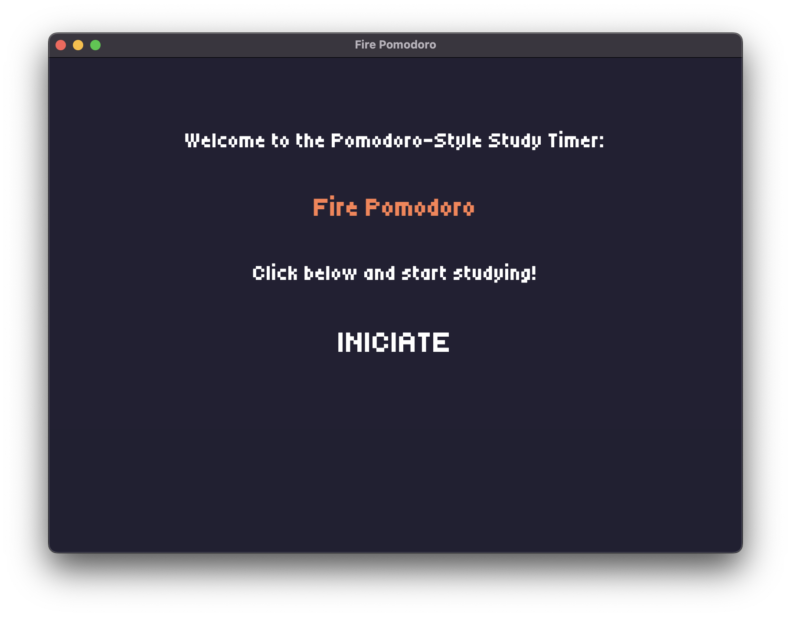

# Fire Pomodoro

Este é um projeto pessoal de **temporizador Pomodoro**, desenvolvido com foco em melhorar a concentração, a disciplina e a gestão do tempo. O objetivo foi criar uma aplicação que ajude a manter o foco nos estudos e ofereça um ambiente relaxante ao som de uma fogueira. 

Além disso, a inspiração para o estilo visual do aplicativo veio dos jogos em **pixel art**.

## Funcionalidades

- Contador Pomodoro padrão (25 minutos de foco)
- Interface simples e minimalista
- Sons de fogueira durante o tempo de estudo
- Registro visual do progresso
- Tema escuro para descansar os olhos

## Tecnologias Utilizadas

- **HTML & CSS** – estrutura e estilo da interface do timer.
- **JavaScript** – lógica do cronômetro Pomodoro.
- **Node.js & Electron** – empacotamento como aplicação de desktop.

## Telas do sistema

### Tela inicial

### Tela principal

### Tela informativa

